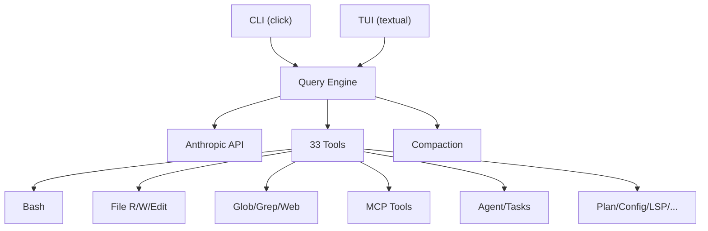

# claude-code

A Python 3.13 AI-powered coding assistant package.

[]()
[]()
[]()

> **Research and educational purposes only. No commercial use permitted.**

---

## Overview

`claude-code` is a fully-featured AI coding assistant built in Python, featuring:

- **33 tools** - File operations, shell execution, search, MCP, agents, tasks, and more
- **Interactive TUI** - Textual-based terminal UI with markdown rendering, vi mode, themes
- **Query engine** - Streaming agent loop with tool execution and context management
- **Permission system** - Configurable modes, rules, auto-approval, denial tracking
- **MCP integration** - Model Context Protocol client with stdio/SSE transports
- **Multi-agent** - Sub-agent spawning with isolated contexts and worktree support
- **Memory system** - CLAUDE.md discovery, MEMORY.md index, frontmatter parsing
- **Hooks** - PreToolUse, PostToolUse, SessionStart and 13 more event types
- **80+ slash commands** - /commit, /review, /plan, /compact, /config, and more
- **Skills & plugins** - Custom skill loading from ~/.claude/skills/

## Quick Start

```bash
# Install with uv
uv pip install -e .

# Set your API key
export ANTHROPIC_API_KEY="sk-ant-..."

# Run
claude-code --version
claude-code -p "explain this codebase"
claude-code  # interactive mode
```

## Documentation

Full documentation at **[abhinaavramesh.github.io/claude-code](https://abhinaavramesh.github.io/claude-code/)**

## Development

```bash
# Clone and install
git clone https://github.com/AbhinaavRamesh/claude-code.git
cd claude-code
uv sync --extra dev

# Run tests (714 passing)
uv run pytest

# Lint & type check
uv run ruff check src/ tests/
uv run mypy src/claude_code/

# Build docs locally
cd docs && npm install && npm run docs:dev
```

## Project Stats

| Metric | Value |
|--------|-------|
| Python files | 232 |
| Lines of code | 16,090 |
| Tools | 33 |
| Tests | 714 |
| Slash commands | 24+ |
| Doc pages | 19 |

## Architecture



---

## Disclaimer

> **This project is provided strictly for technical research, study, and educational purposes.**
>
> - **No commercial use** of any kind is permitted
> - **No enterprise deployment** is authorized
> - This software is not affiliated with or endorsed by Anthropic
> - No warranty is provided; use at your own risk
> - If any content infringes upon rights or interests, please open an issue for removal
>
> By using this software, you agree to these terms.

## License

Research and educational use only. See [Disclaimer](#disclaimer).
