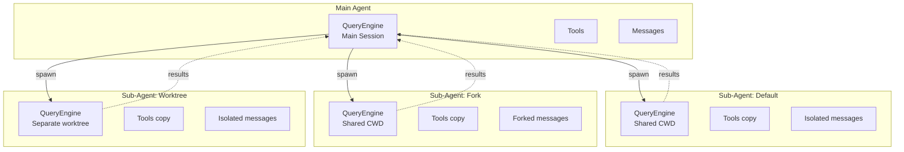
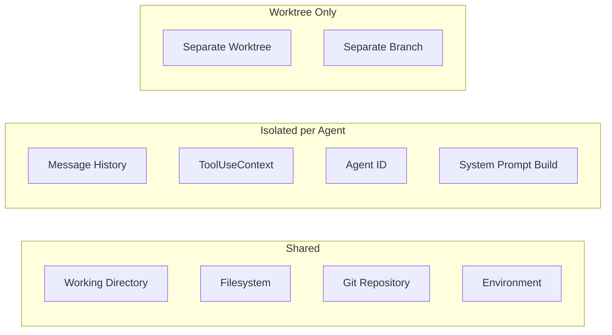
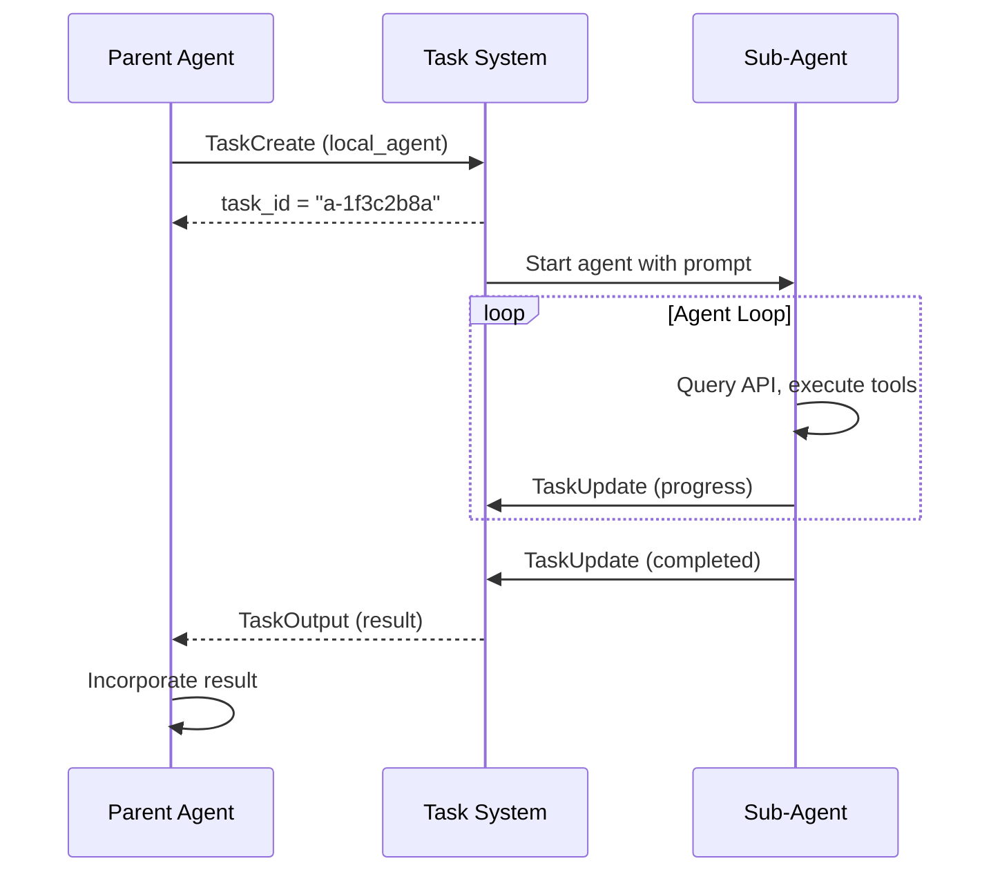

# Agents

Claude Code supports multi-agent architectures where the main agent can spawn **sub-agents** to work on focused tasks in isolated contexts. Sub-agents have full access to the tool ecosystem and can run concurrently.

## Agent Architecture



## Agent Types

| Type | Module | CWD | Messages | Git State | Use Case |
|---|---|---|---|---|---|
| **Default** | `AgentTool` | Shared with parent | Fresh (empty) | Shared | Focused subtask in current project |
| **Fork** | `AgentTool` | Shared with parent | Copy of parent's | Shared | Continue a conversation branch |
| **Worktree** | `WorktreeTool` | Separate git worktree | Fresh (empty) | Isolated branch | Parallel work on different branches |

### Default Agent

The default agent starts with a clean message history but shares the parent's working directory and git state. It is best for self-contained subtasks:

```
> /agent "Refactor the settings module to use pydantic BaseSettings"
```

The agent receives the prompt, builds its own system prompt (including CLAUDE.md), and runs the full query loop. Results are returned to the parent agent.

### Fork Agent

A fork agent copies the parent's current conversation history. This is useful when you want to explore an alternative approach without losing the current context:

```
> /agent --fork "Try a different approach: use TOML instead of JSON for settings"
```

The fork starts from the same conversation state but evolves independently.

### Worktree Agent

A worktree agent creates a new git worktree and operates in a separate branch. This enables true parallel development:

```
> /agent --worktree --branch feature/new-parser "Implement the new parser module"
```

The worktree agent:
1. Creates a git worktree at a temporary path.
2. Checks out the specified branch (or creates a new one).
3. Runs the query loop in the worktree directory.
4. Returns results to the parent; the worktree can be merged later.

## Context Isolation

Each agent type provides different levels of isolation:



### What is shared

- **Working directory** (default and fork agents)
- **Filesystem** (all agents can read/write the same files, except worktree agents which work in their own copy)
- **Settings** (same `settings.json` hierarchy)
- **MCP connections** (same MCP clients)

### What is isolated

- **Message history** — each agent has its own conversation
- **ToolUseContext** — each agent gets a fresh context with its own `agent_id`
- **Agent ID** — a unique identifier for tracking which agent performed an action
- **System prompt** — rebuilt for each agent (CLAUDE.md is re-read)

## Agent Communication

Agents communicate with the parent through the task system:



### Task Types for Agents

| Task Type | Enum Value | Description |
|---|---|---|
| `local_agent` | `LOCAL_AGENT` | Sub-agent running in the same process |
| `remote_agent` | `REMOTE_AGENT` | Agent running on a remote server |
| `in_process_teammate` | `IN_PROCESS_TEAMMATE` | Teammate agent sharing the process |

### Task Lifecycle

1. **Pending** — task created, agent not yet started.
2. **Running** — agent is executing the query loop.
3. **Completed** — agent finished successfully, output available.
4. **Failed** — agent encountered an unrecoverable error.
5. **Killed** — agent was stopped by the parent or user.

## Swarm Mode

For complex tasks requiring multiple agents working in parallel, Claude Code supports **swarm mode**. In swarm mode, the main agent acts as an orchestrator:

1. **Decompose** — the main agent breaks the task into subtasks.
2. **Dispatch** — each subtask is assigned to a sub-agent.
3. **Monitor** — the main agent polls task status via `TaskList` and `TaskGet`.
4. **Aggregate** — results are collected and synthesized.

```
> Break this feature into independent tasks and implement them in parallel using agents.
```

The orchestrator uses `TaskCreate` to spawn agents and `TaskOutput` to read their results. Each agent works independently with its own conversation, tools, and context.

### Agent Definitions

Custom agent types can be defined and stored in `~/.claude/agents/`:

```python
# The agent_definitions field in ToolUseContext
# allows pre-configured agent templates
context = ToolUseContext(
    agent_definitions={
        "reviewer": {
            "prompt": "Review the code changes for bugs and style issues",
            "tools": ["FileRead", "GlobTool", "GrepTool"],
            "mode": "plan",
        },
        "implementer": {
            "prompt": "Implement the specified feature",
            "tools": None,  # All tools
            "mode": "acceptEdits",
        },
    }
)
```

::: tip
Sub-agents inherit the parent's permission rules but each operates with its own permission mode. A parent in `default` mode can spawn a child in `plan` mode for safer exploration.
:::

::: warning
Worktree agents create actual git worktrees on disk. They are cleaned up when the task completes, but if the process is killed unexpectedly, stale worktrees may remain. Use `git worktree prune` to clean them up.
:::
