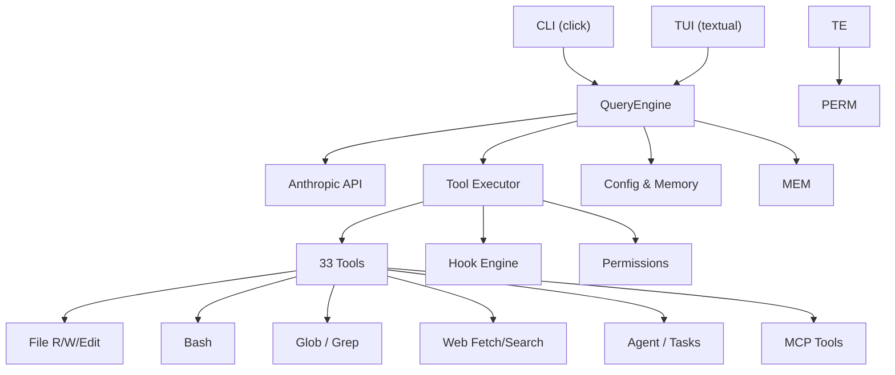
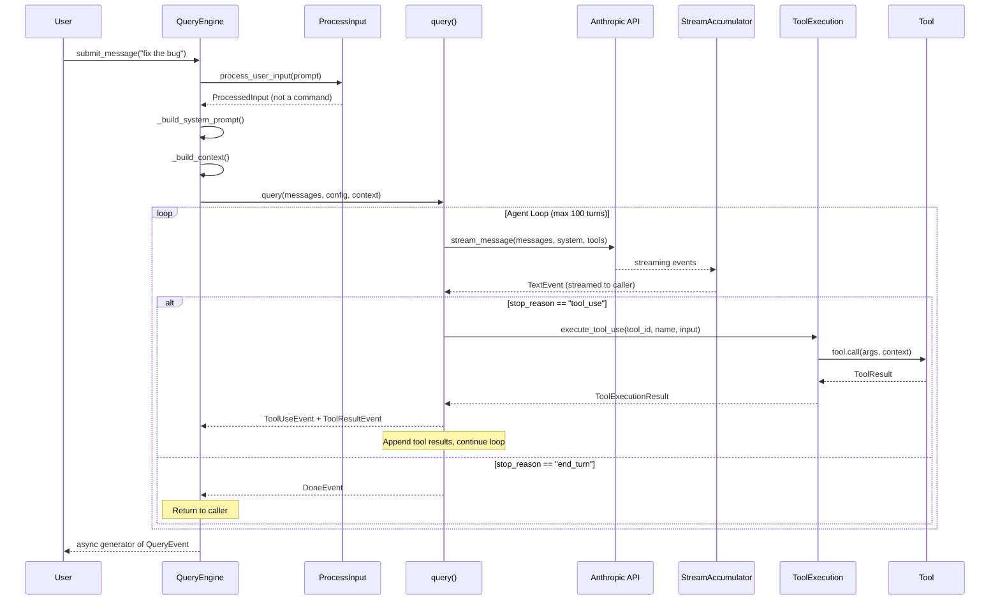

# Architecture

code-assist is structured as a layered system: a CLI shell wraps a `QueryEngine`, which orchestrates the core **agent loop** — sending messages to the Anthropic API, streaming responses, dispatching tool calls, and looping until the model signals completion.

## System Architecture



## Module Overview

| Module | Path | Responsibility |
|---|---|---|
| **cli** | `src/code_assist/cli/` | Click-based entry point, argument parsing |
| **config** | `src/code_assist/config/` | Settings loading/merging, CLAUDE.md discovery, constants |
| **core** | `src/code_assist/core/` | `QueryEngine`, `query()` loop, streaming, input processing |
| **memory** | `src/code_assist/memory/` | Memory file scanning, frontmatter parsing, type definitions |
| **services** | `src/code_assist/services/` | Anthropic API client, tool execution dispatch, error classification |
| **tasks** | `src/code_assist/tasks/` | Background task types (local shell, local agent, remote agent) |
| **tools** | `src/code_assist/tools/` | All built-in tools, tool registry, base protocol/class |
| **tui** | `src/code_assist/tui/` | Terminal UI widgets and themes (Textual framework) |
| **types** | `src/code_assist/types/` | Shared types: messages, permissions, hooks, commands, plugins |
| **utils** | `src/code_assist/utils/` | Auth, cost tracking, logging, token counting, bash parsing |

## Data Flow: Single Turn

The following sequence diagram shows what happens when the user submits a single message:



## Key Abstractions

### Tool Protocol

Every tool implements the `Tool` protocol defined in `tools/base.py`. The protocol mandates:

| Method | Purpose |
|---|---|
| `name` | Unique identifier string |
| `input_schema` | Pydantic `BaseModel` subclass for input validation |
| `call()` | Async execution — receives validated args, context, and progress callback |
| `description()` | Human-readable description for the model's system prompt |
| `is_read_only()` | Whether this invocation mutates state (affects permission logic) |
| `is_concurrency_safe()` | Whether the tool can safely run in parallel |

The concrete `ToolDef` base class provides sensible defaults so most tools only need to implement `call()` and `input_schema`.

### QueryEngine

`QueryEngine` is the primary API surface. It accepts a `QueryEngineConfig` and exposes:

- `submit_message(prompt)` — async generator that yields `QueryEvent` objects.
- `messages` — the full conversation history.
- `clear_messages()` — reset the conversation.
- `total_turns` — cumulative turn count across all queries.

Internally it builds the system prompt from CLAUDE.md files, filters enabled tools, and delegates to the `query()` loop.

### Settings Merge

Settings are loaded and merged in priority order:

```
defaults < global (~/.claude/settings.json)
         < project (.claude/settings.json)
         < local (.claude/settings.local.json)
```

Deep merge is used — nested dicts are merged recursively, while scalar values are replaced by the higher-priority source.

### Permission Engine

Permissions are resolved through a pipeline:

1. **Mode check** — the current `PermissionMode` (default, plan, acceptEdits, bypassPermissions, dontAsk, auto).
2. **Rule matching** — allow/deny rules from settings are matched against `tool_name` and `rule_content`.
3. **Hook override** — `PreToolUse` hooks can approve, deny, or modify tool input.
4. **Classifier** — optional safety classifier for high-risk bash commands.
5. **User prompt** — if no rule matches and mode is `default`, the user is asked.

### Message Types

The internal message format uses dataclasses (`UserMessage`, `AssistantMessage`) with typed content blocks:

- `TextBlock` — plain text content.
- `ToolUseBlock` — a tool call with `id`, `name`, and `input`.
- `ToolResultBlock` — the result of a tool call with `tool_use_id`, `content`, and `is_error`.

These are converted to Anthropic API format before each request.
