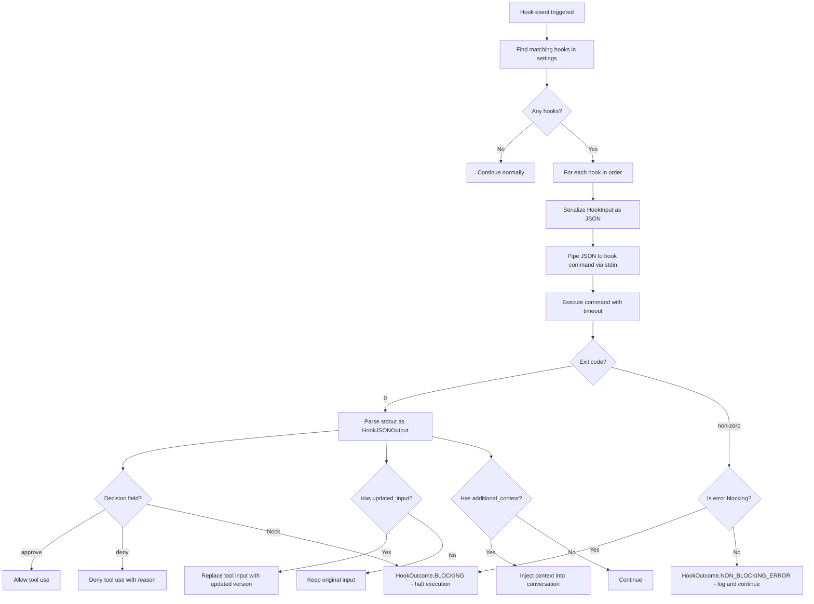

# Hooks

Hooks let you run shell commands at specific points in the code-assist lifecycle. They can approve or deny tool use, modify inputs and outputs, inject context, or trigger external workflows.

## Hook Events

| Event | Enum Value | When It Fires |
|---|---|---|
| **PreToolUse** | `PreToolUse` | Before a tool is executed (after permission check) |
| **PostToolUse** | `PostToolUse` | After a tool executes successfully |
| **PostToolUseFailure** | `PostToolUseFailure` | After a tool execution fails |
| **UserPromptSubmit** | `UserPromptSubmit` | When the user submits a prompt |
| **SessionStart** | `SessionStart` | When a new session begins |
| **Stop** | `Stop` | When the agent loop completes |
| **Notification** | `Notification` | When a notification is sent to the user |
| **SubagentStart** | `SubagentStart` | When a sub-agent is spawned |
| **PermissionDenied** | `PermissionDenied` | When a tool use is denied by permissions |
| **PermissionRequest** | `PermissionRequest` | When the user is prompted for permission |
| **Elicitation** | `Elicitation` | When the model asks the user a question |
| **ElicitationResult** | `ElicitationResult` | When the user answers an elicitation |
| **FileChanged** | `FileChanged` | When a watched file changes on disk |
| **CwdChanged** | `CwdChanged` | When the working directory changes |
| **PreCompact** | `PreCompact` | Before conversation compaction |
| **PostCompact** | `PostCompact` | After conversation compaction |

## Hook Configuration

Hooks are defined in `settings.json` under the `hooks` key. Each hook event maps to an array of hook definitions:

```json
{
  "hooks": {
    "PreToolUse": [
      {
        "command": "python scripts/validate_tool.py",
        "timeout": 5000,
        "name": "tool-validator"
      }
    ],
    "PostToolUse": [
      {
        "command": "python scripts/log_tool_use.py",
        "timeout": 3000,
        "name": "tool-logger"
      }
    ],
    "UserPromptSubmit": [
      {
        "command": "python scripts/check_prompt.py",
        "timeout": 2000,
        "name": "prompt-guard"
      }
    ]
  }
}
```

## Hook Execution Flow



## Input Schema

Every hook receives a `HookInput` as JSON on stdin:

```json
{
  "hook_event": "PreToolUse",
  "tool_name": "BashTool",
  "tool_input": {
    "command": "rm -rf /tmp/old-builds",
    "timeout": 120000,
    "description": "Clean old builds"
  },
  "tool_use_id": "tu_abc123",
  "tool_output": null,
  "user_prompt": null,
  "session_id": "sess_xyz789",
  "agent_id": null,
  "cwd": "/home/user/project"
}
```

### HookInput Fields

| Field | Type | Present For |
|---|---|---|
| `hook_event` | `str` | All events |
| `tool_name` | `str \| null` | `PreToolUse`, `PostToolUse`, `PostToolUseFailure` |
| `tool_input` | `dict \| null` | `PreToolUse`, `PostToolUse` |
| `tool_use_id` | `str \| null` | Tool-related events |
| `tool_output` | `str \| null` | `PostToolUse`, `PostToolUseFailure` |
| `user_prompt` | `str \| null` | `UserPromptSubmit` |
| `session_id` | `str \| null` | All events |
| `agent_id` | `str \| null` | `SubagentStart` |
| `cwd` | `str \| null` | All events |

## Output Schema

Hooks write JSON to stdout. The schema varies by event type.

### PreToolUse Output

```json
{
  "decision": "approve",
  "reason": "Command is safe",
  "updated_input": {
    "command": "rm -rf /tmp/old-builds --dry-run",
    "timeout": 120000
  }
}
```

| Field | Type | Description |
|---|---|---|
| `decision` | `"approve" \| "deny" \| "block"` | Whether to allow the tool use |
| `reason` | `str \| null` | Explanation for the decision |
| `updated_input` | `dict \| null` | Modified tool input (replaces original) |

### PostToolUse Output

```json
{
  "suppress_output": false,
  "updated_output": "Filtered output here...",
  "additional_context": "Note: 3 files were modified"
}
```

| Field | Type | Description |
|---|---|---|
| `suppress_output` | `bool \| null` | Hide the tool output from the model |
| `updated_output` | `str \| null` | Replace the tool output |
| `additional_context` | `str \| null` | Extra context injected into conversation |

### UserPromptSubmit Output

```json
{
  "updated_prompt": "Transformed user prompt here...",
  "prevent_continuation": false
}
```

| Field | Type | Description |
|---|---|---|
| `updated_prompt` | `str \| null` | Replace the user's prompt text |
| `prevent_continuation` | `bool \| null` | Block the prompt from being sent |
| `stop_reason` | `str \| null` | Reason for stopping (if `prevent_continuation`) |

### Universal Output Fields

These fields work across all hook events:

| Field | Type | Description |
|---|---|---|
| `status_message` | `str \| null` | Progress message shown in the UI |
| `additional_context` | `str \| null` | Context injected into the conversation |
| `permission_updates` | `list \| null` | Permission rule changes to apply |
| `retry` | `bool \| null` | Retry the operation after hook completes |

## Hook Outcomes

| Outcome | Enum | Meaning |
|---|---|---|
| Success | `success` | Hook ran, output parsed successfully |
| Blocking | `blocking` | Hook returned a blocking error — halt execution |
| Non-blocking error | `non_blocking_error` | Hook failed but execution continues |
| Cancelled | `cancelled` | Hook was cancelled (timeout or abort) |

## Examples

### Lint before file write

```json
{
  "hooks": {
    "PostToolUse": [
      {
        "command": "python -c \"import sys, json; d=json.load(sys.stdin); path=d.get('tool_input',{}).get('file_path',''); import subprocess; r=subprocess.run(['ruff','check',path],capture_output=True,text=True) if path.endswith('.py') and d.get('tool_name')=='FileWriteTool' else None; json.dump({'additional_context': f'Lint results: {r.stdout}' if r else {}}, sys.stdout)\"",
        "timeout": 10000,
        "name": "auto-lint"
      }
    ]
  }
}
```

### Block dangerous bash commands

```python
#!/usr/bin/env python3
"""hooks/block_dangerous.py - PreToolUse hook to block dangerous commands."""
import json
import sys

BLOCKED_PATTERNS = ["rm -rf /", "sudo", "chmod 777", "> /dev/"]

data = json.load(sys.stdin)
if data.get("tool_name") == "BashTool":
    cmd = data.get("tool_input", {}).get("command", "")
    for pattern in BLOCKED_PATTERNS:
        if pattern in cmd:
            json.dump({
                "decision": "deny",
                "reason": f"Blocked: command contains '{pattern}'"
            }, sys.stdout)
            sys.exit(0)

json.dump({"decision": "approve"}, sys.stdout)
```

```json
{
  "hooks": {
    "PreToolUse": [
      {
        "command": "python hooks/block_dangerous.py",
        "timeout": 3000,
        "name": "danger-guard"
      }
    ]
  }
}
```

### Log all tool usage

```python
#!/usr/bin/env python3
"""hooks/log_tools.py - PostToolUse hook that logs tool usage."""
import json
import sys
from datetime import datetime, timezone

data = json.load(sys.stdin)
log_entry = {
    "timestamp": datetime.now(timezone.utc).isoformat(),
    "event": data["hook_event"],
    "tool": data.get("tool_name"),
    "session": data.get("session_id"),
}

with open("tool_usage.jsonl", "a") as f:
    f.write(json.dumps(log_entry) + "\n")

json.dump({}, sys.stdout)
```

::: tip
Hooks are executed sequentially in the order they appear in the configuration array. If a `PreToolUse` hook returns `"decision": "deny"`, subsequent hooks for that event are still executed but their decisions are aggregated — a single `deny` or `block` takes precedence.
:::

::: warning
Hook commands run with the same permissions as the code-assist process. Be careful with hook scripts that accept untrusted input from `tool_input` or `user_prompt` fields.
:::
