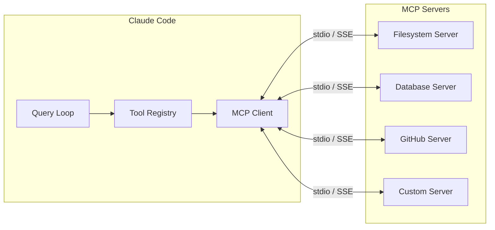

# MCP Servers

Claude Code has first-class support for the **Model Context Protocol (MCP)** — an open protocol that lets you connect external tool and resource servers. MCP servers extend Claude Code's capabilities without modifying the core codebase.

## Overview

MCP enables a standardized way for AI models to:

- **Discover tools** exposed by external servers
- **Execute tool calls** against those servers
- **Access resources** (files, database rows, API responses) through a uniform interface
- **Receive notifications** from long-running server processes

Claude Code acts as an **MCP client**. You configure one or more MCP servers in `settings.json`, and their tools become available alongside the built-in tool set.



## Server Configuration

MCP servers are defined in `settings.json` under the `mcpServers` key:

```json
{
  "mcpServers": {
    "server-name": {
      "command": "executable",
      "args": ["arg1", "arg2"],
      "env": {
        "KEY": "value"
      }
    }
  }
}
```

### Configuration Fields

| Field | Type | Required | Description |
|---|---|---|---|
| `command` | `str` | Yes | The executable to run (e.g., `npx`, `python`, `node`) |
| `args` | `list[str]` | No | Command-line arguments |
| `env` | `dict[str, str]` | No | Environment variables for the server process |

## Transport Types

MCP supports two transport mechanisms:

### stdio (default)

The server communicates over stdin/stdout using JSON-RPC. Claude Code spawns the server as a child process.

```json
{
  "mcpServers": {
    "filesystem": {
      "command": "npx",
      "args": ["-y", "@modelcontextprotocol/server-filesystem", "/allowed/path"]
    }
  }
}
```

### SSE (Server-Sent Events)

For remote servers, MCP supports HTTP-based transport with server-sent events for streaming:

```json
{
  "mcpServers": {
    "remote-server": {
      "url": "https://mcp.example.com/sse",
      "headers": {
        "Authorization": "Bearer token-here"
      }
    }
  }
}
```

## Tool Discovery

When Claude Code starts, it connects to each configured MCP server and discovers available tools:

1. **Initialize** — send `initialize` request with client capabilities.
2. **List tools** — call `tools/list` to enumerate available tools with their names, descriptions, and input schemas.
3. **Register** — wrap each MCP tool as a `McpTool` instance and add to the tool registry.
4. **Ready** — MCP tools appear alongside built-in tools and are available to the model.

MCP tools are presented to the model with the server name prefix when there are name conflicts: `server-name:tool-name`.

## Resource Handling

MCP servers can also expose **resources** — named pieces of content the model can reference:

```json
{
  "mcpServers": {
    "docs-server": {
      "command": "python",
      "args": ["-m", "docs_mcp_server"],
      "resources": true
    }
  }
}
```

Resources are stored in the `ToolUseContext.mcp_resources` dictionary, keyed by server name. They can be injected into the system prompt or referenced by tools.

## Example MCP Server Setup

### Filesystem Server

Gives Claude Code controlled access to specific directories:

```json
{
  "mcpServers": {
    "filesystem": {
      "command": "npx",
      "args": [
        "-y",
        "@modelcontextprotocol/server-filesystem",
        "/home/user/projects",
        "/home/user/documents"
      ]
    }
  }
}
```

### SQLite Database Server

Query and modify a SQLite database:

```json
{
  "mcpServers": {
    "sqlite": {
      "command": "npx",
      "args": [
        "-y",
        "@modelcontextprotocol/server-sqlite",
        "/path/to/database.db"
      ]
    }
  }
}
```

### Custom Python MCP Server

Write your own MCP server in Python using the `mcp` library (which is already a dependency of claude-code):

```python
"""my_mcp_server.py - A minimal MCP server."""
from mcp.server import Server
from mcp.types import Tool, TextContent

server = Server("my-server")


@server.list_tools()
async def list_tools():
    return [
        Tool(
            name="lookup_user",
            description="Look up a user by email address",
            inputSchema={
                "type": "object",
                "properties": {
                    "email": {
                        "type": "string",
                        "description": "The email address to look up",
                    }
                },
                "required": ["email"],
            },
        )
    ]


@server.call_tool()
async def call_tool(name: str, arguments: dict):
    if name == "lookup_user":
        email = arguments["email"]
        # ... your lookup logic ...
        return [TextContent(type="text", text=f"User found: {email}")]
    raise ValueError(f"Unknown tool: {name}")


if __name__ == "__main__":
    import asyncio
    from mcp.server.stdio import stdio_server

    async def main():
        async with stdio_server() as (read, write):
            await server.run(read, write)

    asyncio.run(main())
```

Register it in settings:

```json
{
  "mcpServers": {
    "my-server": {
      "command": "python",
      "args": ["-m", "my_mcp_server"],
      "env": {
        "DATABASE_URL": "postgresql://localhost/mydb"
      }
    }
  }
}
```

### GitHub Server

Interact with GitHub issues, PRs, and repositories:

```json
{
  "mcpServers": {
    "github": {
      "command": "npx",
      "args": ["-y", "@modelcontextprotocol/server-github"],
      "env": {
        "GITHUB_TOKEN": "ghp_..."
      }
    }
  }
}
```

## Permissions for MCP Tools

MCP tools go through the same permission system as built-in tools. You can write rules for them:

```json
{
  "permissions": {
    "allow": [
      "mcp__filesystem__read_file",
      "mcp__sqlite__read_query"
    ],
    "deny": [
      "mcp__filesystem__write_file",
      "mcp__sqlite__write_query"
    ]
  }
}
```

The tool name format for MCP tools is `mcp__<server>__<tool>`.

::: tip
MCP servers run as separate processes. They are started when Claude Code initializes and stopped when the session ends. Long-running servers (like database connections) maintain state across tool calls.
:::

::: warning
MCP servers have access to whatever the `command` executable can reach. Always review server configurations carefully, especially when using third-party servers. Set restrictive `env` variables and filesystem paths.
:::
