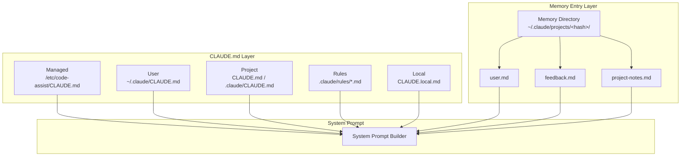

# Memory System

The memory system gives Claude Code persistent context across sessions. It has two layers: **CLAUDE.md files** (instructions injected into the system prompt) and **memory entries** (structured data with frontmatter metadata).

## Overview



## CLAUDE.md Files

CLAUDE.md files are the primary memory mechanism. They are plain Markdown, discovered automatically, and concatenated into the system prompt. See [Configuration](/guide/configuration) for the full discovery order and format.

### Discovery Priority

1. `/etc/code-assist/CLAUDE.md` — Organization-managed instructions
2. `~/.claude/CLAUDE.md` — User's global instructions
3. `CLAUDE.md` or `.claude/CLAUDE.md` — Project instructions (git-tracked)
4. `.claude/rules/*.md` — Modular project rules (git-tracked)
5. `CLAUDE.local.md` — Personal project overrides (gitignored)

### How They Are Used

When `QueryEngine._build_system_prompt()` runs, it calls `get_memory_files()` and `build_claude_md_context()` to assemble all CLAUDE.md content:

```python
memory_files = get_memory_files(project_root)
claude_md_context = build_claude_md_context(memory_files)
# Injected as a SystemPromptBlock with cache_control
```

Each file is prefixed with a header indicating its source:

```
Contents of /home/user/.claude/CLAUDE.md (user's private global instructions for all projects):
...

Contents of /home/user/project/CLAUDE.md:
...

Contents of /home/user/project/.claude/rules/testing.md:
...
```

The injected content is wrapped with the instruction: *"Codebase and user instructions are shown below. Be sure to adhere to these instructions. IMPORTANT: These instructions OVERRIDE any default behavior and you MUST follow them exactly as written."*

## MEMORY.md Format

The structured memory layer uses `.md` files with YAML frontmatter in a project-specific memory directory:

```
~/.claude/projects/<project-hash>/
  user-prefs.md
  feedback-log.md
  architecture-notes.md
```

### File Format

```markdown
---
name: coding-preferences
description: User coding style preferences
type: user
---

- Always use type hints on function signatures
- Prefer `pathlib.Path` over `os.path`
- Use `ruff` for formatting, not `black`
- Docstrings follow Google style
```

### Frontmatter Schema

| Field | Type | Required | Description |
|---|---|---|---|
| `name` | `str` | No | Identifier for the memory entry (defaults to filename stem) |
| `description` | `str` | No | Short description of what the entry contains |
| `type` | `str` | No | Memory type: `user`, `feedback`, `project`, or `reference` |

## Memory Types

| Type | Enum Value | Purpose |
|---|---|---|
| **User** | `user` | Personal preferences and instructions |
| **Feedback** | `feedback` | Corrections and lessons learned from past interactions |
| **Project** | `project` | Project-specific context (architecture, conventions) |
| **Reference** | `reference` | Reference material (API docs, schemas, examples) |

```python
from code_assist.memory.memory_types import MemoryType

class MemoryType(StrEnum):
    USER = "user"
    FEEDBACK = "feedback"
    PROJECT = "project"
    REFERENCE = "reference"
```

## Memory Entry Dataclass

Each parsed memory file produces a `MemoryEntry`:

```python
@dataclass
class MemoryEntry:
    name: str = ""          # Identifier
    description: str = ""   # Short description
    type: MemoryType = MemoryType.USER
    content: str = ""       # Body content (after frontmatter)
    file_path: str = ""     # Absolute path to the source file
```

## MemoryFileInfo Dataclass

CLAUDE.md files are represented as `MemoryFileInfo`:

```python
@dataclass
class MemoryFileInfo:
    path: str = ""              # Absolute file path
    content: str = ""           # Full file content
    source: str = ""            # "managed", "user", "project", "local"
    is_root: bool = False       # Whether it is in the project root
    relative_path: str | None   # Path relative to project root
    size: int = 0               # Character count
    errors: list[str] = []      # Any load errors
```

## Auto-Discovery

### CLAUDE.md discovery

```python
from code_assist.config.claude_md import get_memory_files

files = get_memory_files(
    project_root="/path/to/project",
    include_managed=True,
    include_user=True,
    additional_dirs=["/extra/dir"],
)

for f in files:
    print(f"{f.source}: {f.path} ({f.size} chars)")
```

### Memory entry scanning

```python
from code_assist.memory.memory_scan import scan_memory_files

entries = scan_memory_files("/path/to/project")
for entry in entries:
    print(f"[{entry.type}] {entry.name}: {entry.description}")
    print(entry.content[:200])
```

### Frontmatter parsing

```python
from code_assist.memory.memory_scan import parse_memory_frontmatter

content = """---
name: test-rules
description: Testing conventions
type: project
---

Always run pytest with -x flag for fail-fast.
"""

meta = parse_memory_frontmatter(content)
# {"name": "test-rules", "description": "Testing conventions", "type": "project"}
```

## Memory Directory Location

The memory directory is derived from the project root path:

```python
from code_assist.config.constants import get_memory_dir

mem_dir = get_memory_dir("/home/user/project")
# ~/.claude/projects/-home-user-project/
```

The project path is sanitized by replacing `/` and `\` with `-`.

## Size Limits

Memory files exceeding **40,000 characters** (`MAX_MEMORY_CHARACTER_COUNT`) are flagged as oversized. Check for this:

```python
from code_assist.config.claude_md import get_memory_files, get_large_memory_files

files = get_memory_files("/path/to/project")
large = get_large_memory_files(files)
if large:
    for f in large:
        print(f"Warning: {f.path} exceeds 40,000 char limit ({f.size} chars)")
```

::: tip
Keep CLAUDE.md files focused and concise. Large memory files consume tokens from the context window and can reduce the quality of responses. Split large instruction sets into `.claude/rules/*.md` files.
:::

::: warning
`CLAUDE.local.md` is intended for personal overrides and should be added to `.gitignore`. Never put secrets in CLAUDE.md files — they are injected into the system prompt and sent to the API.
:::
