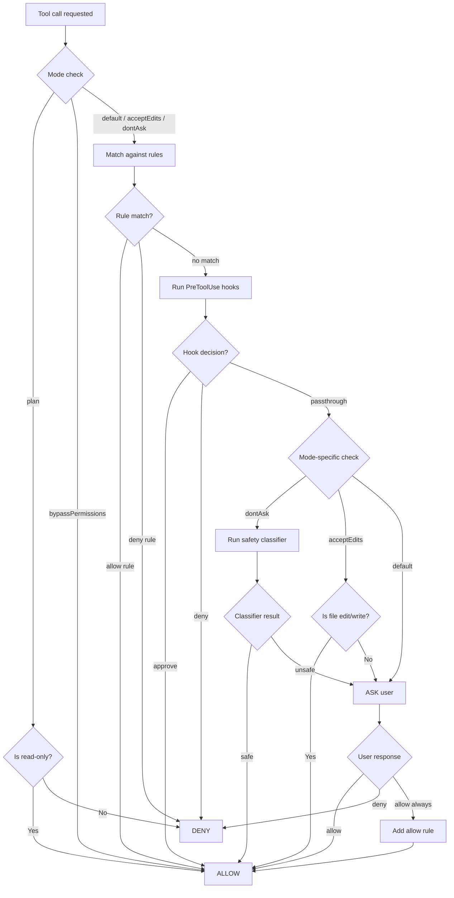

# Permissions

The permission system controls which tools the model can execute and under what conditions. It supports multiple modes, rule-based allow/deny lists, hook-driven overrides, and safety classifiers.

## Permission Modes

| Mode | Enum Value | Behavior |
|---|---|---|
| **Default** | `default` | Ask the user before each non-read-only tool use |
| **Plan** | `plan` | Model can only use read-only tools (search, read, glob) |
| **Accept Edits** | `acceptEdits` | Auto-approve file writes/edits, still ask for bash and destructive ops |
| **Don't Ask** | `dontAsk` | Auto-approve everything with safety classifier backstop |
| **Bypass Permissions** | `bypassPermissions` | Skip all permission checks (dangerous — for trusted environments only) |
| **Auto** | `auto` | Like `dontAsk` but for automated/CI pipelines |
| **Bubble** | `bubble` | Delegate permission decisions to the parent agent |

::: warning
`bypassPermissions` skips **all** safety checks including the classifier. Only use this in sandboxed environments where the model cannot cause real harm.
:::

## Permission Flow



## Rule Configuration

Permission rules are defined in `settings.json` under the `permissions` key:

```json
{
  "permissions": {
    "allow": [
      "Bash(npm test)",
      "Bash(git *)",
      "FileRead",
      "GlobTool",
      "GrepTool",
      "WebFetchTool"
    ],
    "deny": [
      "Bash(rm -rf *)",
      "Bash(sudo *)"
    ]
  }
}
```

### Rule Syntax

Each rule is a string in the format `ToolName` or `ToolName(pattern)`:

| Rule | Meaning |
|---|---|
| `FileRead` | Allow/deny all `FileRead` tool uses |
| `Bash(npm test)` | Match bash commands that exactly equal `npm test` |
| `Bash(git *)` | Match bash commands starting with `git ` (glob pattern) |
| `Bash(rm -rf *)` | Deny any `rm -rf` command |
| `FileWrite(/tmp/*)` | Match file writes to paths under `/tmp/` |

### Rule Sources

Rules come from multiple sources, resolved in priority order:

| Source | Enum | Priority | Location |
|---|---|---|---|
| Policy settings | `policySettings` | Highest | Managed by org admin |
| CLI argument | `cliArg` | High | `--allow` / `--deny` flags |
| Local settings | `localSettings` | Medium-High | `.claude/settings.local.json` |
| Project settings | `projectSettings` | Medium | `.claude/settings.json` |
| User settings | `userSettings` | Low | `~/.claude/settings.json` |
| Session | `session` | Lowest | In-memory, current session only |

## Auto-Approval Logic

When the mode is `dontAsk`, the system runs a **safety classifier** before auto-approving potentially dangerous operations:

1. The classifier receives the tool name, input, and recent conversation context.
2. It returns a `YoloClassifierResult` with `should_block: bool` and `reason: str`.
3. If `should_block` is `True`, the user is still prompted for confirmation.
4. Two-stage classification is supported (`fast` then `thinking`) for high-risk commands.

```python
@dataclass
class YoloClassifierResult:
    thinking: str | None = None
    should_block: bool = False
    reason: str = ""
    model: str = ""
    stage: Literal["fast", "thinking"] | None = None
```

## Permission Decision Types

The permission engine returns one of four decision types:

### PermissionAllowDecision

```python
PermissionAllowDecision(
    behavior="allow",
    updated_input=None,        # Hook may have modified input
    user_modified=False,       # Whether user edited the input
    decision_reason=RuleDecisionReason(rule=...),
)
```

### PermissionAskDecision

```python
PermissionAskDecision(
    behavior="ask",
    message="BashTool wants to run: rm -rf /tmp/old",
    suggestions=[AddRulesUpdate(...)],  # Suggested always-allow rule
)
```

### PermissionDenyDecision

```python
PermissionDenyDecision(
    behavior="deny",
    message="Denied by project settings rule",
    decision_reason=RuleDecisionReason(rule=...),
)
```

### PermissionPassthroughDecision

```python
PermissionPassthroughDecision(
    behavior="passthrough",
    message="Delegating to parent agent",
)
```

## Risk Levels

Each permission prompt can include a risk assessment:

| Level | Description |
|---|---|
| `LOW` | Read-only operations, safe commands |
| `MEDIUM` | File writes, common build commands |
| `HIGH` | Destructive operations, network access, sudo |

```python
@dataclass
class PermissionExplanation:
    risk_level: RiskLevel = RiskLevel.LOW
    explanation: str = ""
    reasoning: str = ""
    risk: str = ""
```

## Settings Examples

### Permissive development setup

```json
{
  "permissions": {
    "allow": [
      "Bash(npm *)",
      "Bash(python *)",
      "Bash(git *)",
      "Bash(pytest *)",
      "Bash(ruff *)",
      "FileRead",
      "FileWrite",
      "FileEdit",
      "GlobTool",
      "GrepTool"
    ],
    "deny": [
      "Bash(sudo *)",
      "Bash(rm -rf /)"
    ]
  }
}
```

### Restrictive CI setup

```json
{
  "permissions": {
    "allow": [
      "FileRead",
      "GlobTool",
      "GrepTool",
      "Bash(pytest *)",
      "Bash(ruff check *)"
    ],
    "deny": [
      "Bash(*)",
      "FileWrite",
      "FileEdit"
    ]
  }
}
```

::: tip
In CI environments, use `--permission-mode auto` with a restrictive allow list. The `auto` mode skips interactive prompts and relies entirely on rules and the classifier.
:::
