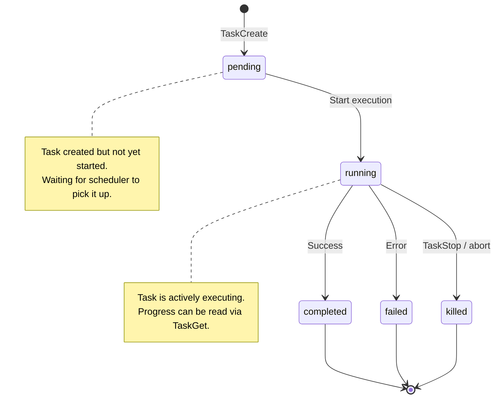

# Tasks

Tasks are background operations managed by code-assist. They provide a way to run long-running processes, sub-agents, and scheduled work alongside the main interactive session.

## Task Types

| Type | Enum Value | ID Prefix | Description |
|---|---|---|---|
| **Local Bash** | `local_bash` | `b` | A shell command running in the background |
| **Local Agent** | `local_agent` | `a` | A sub-agent running in the same process |
| **Remote Agent** | `remote_agent` | `r` | An agent running on a remote server |
| **In-Process Teammate** | `in_process_teammate` | `t` | A teammate agent sharing the process |
| **Local Workflow** | `local_workflow` | `w` | A multi-step workflow pipeline |
| **Monitor MCP** | `monitor_mcp` | `m` | An MCP server monitoring task |
| **Dream** | `dream` | `d` | A background reasoning/planning task |

## Task Lifecycle



### Status Definitions

| Status | Enum Value | Description |
|---|---|---|
| **Pending** | `pending` | Task has been created but execution has not started |
| **Running** | `running` | Task is actively executing |
| **Completed** | `completed` | Task finished successfully |
| **Failed** | `failed` | Task terminated due to an error |
| **Killed** | `killed` | Task was manually stopped (via `TaskStop` or abort) |

## Task Data Model

```python
@dataclass
class Task:
    task_id: str = ""                       # Unique ID (prefix + UUID fragment)
    task_type: TaskType = TaskType.LOCAL_BASH
    status: TaskStatus = TaskStatus.PENDING
    subject: str = ""                       # Short description
    description: str = ""                   # Detailed description
    active_form: str | None = None          # Current active representation
    owner: str | None = None                # Agent ID of the owner
    metadata: dict[str, Any] = {}           # Arbitrary metadata
    blocks: list[str] = []                  # Task IDs this task blocks
    blocked_by: list[str] = []              # Task IDs blocking this task
    output_file: str | None = None          # Path to output file
    created_at: float = 0.0                 # Unix timestamp
    updated_at: float = 0.0                 # Unix timestamp
```

### Task ID Generation

Task IDs are composed of a type prefix and a short UUID:

```python
from code_assist.tasks.types import generate_task_id, TaskType

task_id = generate_task_id(TaskType.LOCAL_AGENT)
# e.g., "a-1f3c2b8a"

task_id = generate_task_id(TaskType.LOCAL_BASH)
# e.g., "b-9e7d4a2c"
```

## Task Tools

The `task_tools` module provides six tools for managing tasks:

### TaskCreate

Create a new background task.

```python
class TaskCreateInput(BaseModel):
    task_type: str         # "local_bash", "local_agent", etc.
    subject: str           # Short description
    description: str = ""  # Detailed description
    command: str = ""      # For local_bash: the shell command
    prompt: str = ""       # For local_agent: the agent prompt
```

### TaskGet

Retrieve details about a specific task.

```python
class TaskGetInput(BaseModel):
    task_id: str           # The task ID to look up
```

### TaskList

List all tasks, optionally filtered by status.

```python
class TaskListInput(BaseModel):
    status: str | None = None  # Filter by status (pending, running, etc.)
```

### TaskUpdate

Update a task's status or metadata.

```python
class TaskUpdateInput(BaseModel):
    task_id: str
    status: str | None = None
    subject: str | None = None
    description: str | None = None
    metadata: dict | None = None
```

### TaskStop

Stop a running task.

```python
class TaskStopInput(BaseModel):
    task_id: str
    reason: str = ""       # Reason for stopping
```

### TaskOutput

Read the output of a completed task.

```python
class TaskOutputInput(BaseModel):
    task_id: str
```

## Background Task Management

### Creating a bash task

```
> Run the test suite in the background while I work on something else
```

The model uses `TaskCreate` with `task_type: "local_bash"` and `command: "pytest -x"`.

### Creating an agent task

```
> Spawn an agent to refactor the utils module
```

The model uses `TaskCreate` with `task_type: "local_agent"` and provides a prompt.

### Monitoring tasks

```
> What tasks are currently running?
```

The model uses `TaskList` with `status: "running"`.

### Reading results

```
> Show me the output of task a-1f3c2b8a
```

The model uses `TaskOutput` to retrieve the task's result.

## Task Dependencies

Tasks support dependency tracking through `blocks` and `blocked_by` fields:

```python
task_a = Task(
    task_id="a-1111",
    subject="Parse config",
    blocks=["a-2222"],       # a-2222 cannot start until a-1111 completes
)

task_b = Task(
    task_id="a-2222",
    subject="Use parsed config",
    blocked_by=["a-1111"],   # Blocked until a-1111 completes
)
```

The scheduler respects these dependencies when deciding which tasks to execute.

## Task Output Storage

Large task outputs are persisted to disk:

```python
from code_assist.config.constants import get_task_output_dir

output_dir = get_task_output_dir()
# ~/.claude/task-output/
```

Each task writes its output to `~/.claude/task-output/<task_id>.txt` and stores the path in `task.output_file`.

## Task Modules

| Module | Path | Responsibility |
|---|---|---|
| `types.py` | `tasks/types.py` | `Task`, `TaskType`, `TaskStatus` dataclasses |
| `local_shell_task.py` | `tasks/local_shell_task.py` | Execute bash commands as tasks |
| `local_agent_task.py` | `tasks/local_agent_task.py` | Execute sub-agent tasks |
| `remote_agent_task.py` | `tasks/remote_agent_task.py` | Execute remote agent tasks |
| `stop_task.py` | `tasks/stop_task.py` | Task cancellation logic |

::: tip
Use `DISABLE_BACKGROUND_TASKS: true` in advanced settings to prevent task creation in environments where background work is not desired (e.g., CI pipelines with strict resource limits).
:::

::: warning
Background tasks share the filesystem with the main session. If a background agent modifies a file that the main agent is also editing, conflicts can occur. Use the dependency system or worktree agents to avoid this.
:::
