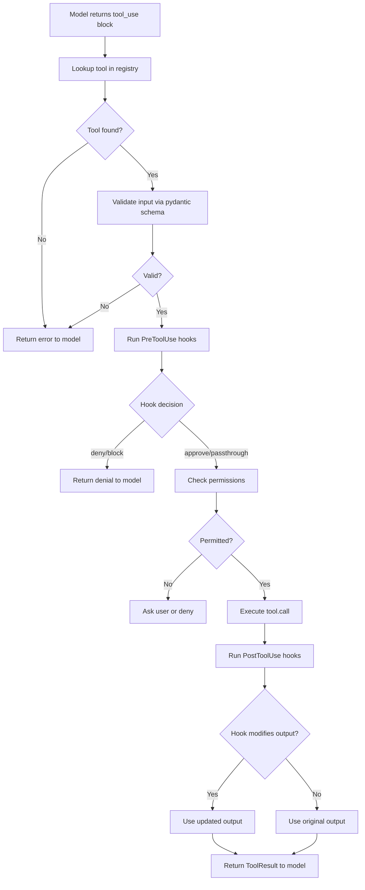

# Tools Reference

Tools are the actions code-assist can take on your behalf. Every tool implements the `Tool` protocol, accepts pydantic-validated input, and returns a `ToolResult`.

## Built-in Tools

The tool registry (`tools/registry.py`) assembles all available tools at startup:

| Tool | Module | Description | Read-Only | Concurrency Safe |
|---|---|---|:---:|:---:|
| **BashTool** | `tools/bash/` | Execute shell commands with sandboxing and security checks | No | No |
| **FileReadTool** | `tools/file_read/` | Read file contents with line range support | Yes | Yes |
| **FileWriteTool** | `tools/file_write/` | Create or overwrite files | No | Yes |
| **FileEditTool** | `tools/file_edit/` | Surgical string replacement in existing files | No | Yes |
| **NotebookEditTool** | `tools/notebook_edit/` | Edit Jupyter notebook cells | No | Yes |
| **GlobTool** | `tools/glob_tool/` | Fast file pattern matching (e.g., `**/*.py`) | Yes | Yes |
| **GrepTool** | `tools/grep_tool/` | Regex content search powered by ripgrep | Yes | Yes |
| **WebFetchTool** | `tools/web_fetch/` | Fetch content from a URL | Yes | Yes |
| **WebSearchTool** | `tools/web_search/` | Web search via external provider | Yes | Yes |
| **ToolSearchTool** | `tools/tool_search/` | Discover deferred tools by keyword | Yes | Yes |

### Additional Tool Modules

These tools are registered dynamically based on context (MCP connections, agent mode, etc.):

| Tool | Module | Description |
|---|---|---|
| **AgentTool** | `tools/agent_tool/` | Spawn sub-agent in isolated context |
| **TaskCreate** | `tools/task_tools/` | Create a background task |
| **TaskUpdate** | `tools/task_tools/` | Update task status or metadata |
| **TaskStop** | `tools/task_tools/` | Stop a running task |
| **TaskGet** | `tools/task_tools/` | Retrieve task details |
| **TaskList** | `tools/task_tools/` | List all tasks |
| **TaskOutput** | `tools/task_tools/` | Read task output |
| **SkillTool** | `tools/skill_tool/` | Execute a registered skill |
| **PlanMode** | `tools/plan_mode/` | Toggle plan-only mode |
| **SendMessage** | `tools/send_message/` | Send a message to the user |
| **AskUser** | `tools/ask_user/` | Ask the user a question |
| **ConfigTool** | `tools/config_tool/` | Read/modify runtime configuration |
| **TodoWrite** | `tools/todo_write/` | Write to the todo/checklist |
| **WorktreeTool** | `tools/worktree/` | Git worktree operations |
| **LspTool** | `tools/lsp_tool/` | Language Server Protocol integration |
| **CronTools** | `tools/cron_tools/` | Schedule recurring tasks |
| **McpTool** | `tools/mcp_tool/` | Bridge to MCP-provided tools |
| **TeamTools** | `tools/team_tools/` | Multi-user collaboration tools |

## Tool Execution Lifecycle



## Input Schema Examples

Each tool's input is validated by a pydantic `BaseModel`. Below are representative schemas.

### BashTool

```python
from pydantic import BaseModel

class BashInput(BaseModel):
    command: str                       # The shell command to execute
    timeout: int = 120000              # Timeout in milliseconds (max 600000)
    description: str = ""              # What this command does
    run_in_background: bool = False    # Run asynchronously
```

### FileReadTool

```python
class FileReadInput(BaseModel):
    file_path: str                     # Absolute path to the file
    offset: int | None = None          # Start line (1-based)
    limit: int | None = None           # Number of lines to read
    pages: str | None = None           # Page range for PDFs ("1-5")
```

### FileEditTool

```python
class FileEditInput(BaseModel):
    file_path: str                     # Absolute path to the file
    old_string: str                    # Exact text to find
    new_string: str                    # Replacement text
    replace_all: bool = False          # Replace all occurrences
```

### FileWriteTool

```python
class FileWriteInput(BaseModel):
    file_path: str                     # Absolute path to write
    content: str                       # Full file content
```

### GlobTool

```python
class GlobInput(BaseModel):
    pattern: str                       # Glob pattern (e.g., "**/*.py")
    path: str | None = None            # Directory to search in
```

### GrepTool

```python
class GrepInput(BaseModel):
    pattern: str                       # Regex pattern to search for
    path: str | None = None            # File or directory to search
    glob: str | None = None            # File glob filter
    type: str | None = None            # File type filter (e.g., "py")
    output_mode: str = "files_with_matches"  # content, files_with_matches, count
    context: int | None = None         # Lines of context around matches
    head_limit: int = 250              # Max results
```

### WebFetchTool

```python
class WebFetchInput(BaseModel):
    url: str                           # URL to fetch
    headers: dict[str, str] | None = None
```

## Custom Tool Creation

You can create custom tools by subclassing `ToolDef`:

```python
from pydantic import BaseModel
from code_assist.tools.base import ToolDef, ToolResult, ToolUseContext, CanUseToolFn, ToolCallProgress
from code_assist.types.message import AssistantMessage


class MyToolInput(BaseModel):
    """Input schema for MyTool."""
    query: str
    limit: int = 10


class MyTool(ToolDef):
    """A custom tool example."""

    name = "my_custom_tool"
    aliases = ["mct"]
    search_hint = "custom query tool"
    max_result_size_chars = 50_000

    @property
    def input_schema(self) -> type[BaseModel]:
        return MyToolInput

    async def call(
        self,
        args: BaseModel,
        context: ToolUseContext,
        can_use_tool: CanUseToolFn,
        parent_message: AssistantMessage,
        on_progress: ToolCallProgress | None = None,
    ) -> ToolResult:
        inp = args  # Already validated as MyToolInput
        # ... your logic here ...
        return ToolResult(data=f"Found {inp.limit} results for '{inp.query}'")

    async def description(self, input: BaseModel, options) -> str:
        return f"Searching for: {input.query}"  # type: ignore[attr-defined]

    def is_read_only(self, input: BaseModel) -> bool:
        return True  # This tool does not mutate state

    def is_concurrency_safe(self, input: BaseModel) -> bool:
        return True
```

Register it by adding an instance to the tools list returned by `get_all_tools()` in `tools/registry.py`, or pass it directly to `QueryEngineConfig.tools`.

::: tip
The `ToolDef` base class provides default implementations for `is_enabled()`, `is_read_only()`, `is_concurrency_safe()`, `validate_input()`, and `check_permissions()`. Override only what you need.
:::

::: warning
Tools that mutate the filesystem should return `is_read_only() = False` and `is_concurrency_safe() = False` to ensure the permission system and scheduler handle them correctly.
:::
